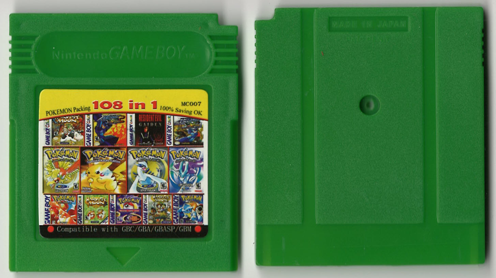
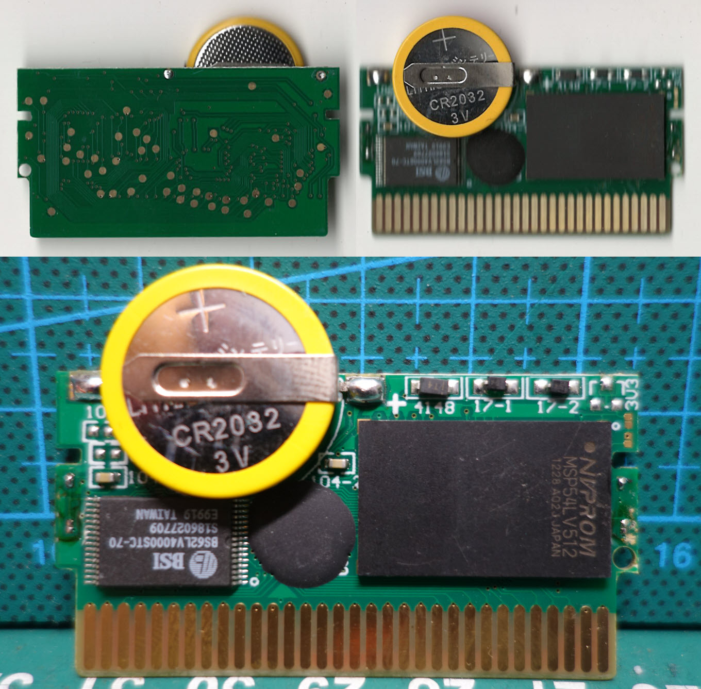
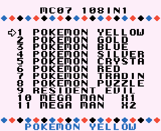

High quality PCB, support save.\
Menu is similar to the [61 in 1](https://github.com/Xyl2k/Gameboy-multicarts/tree/main/61%20in%201)

Menu-dump available.

Writings on PCB:
- BSI BS62LV4000STC-70 S186027709 E9919
- NVPROM MSP54LV512 1228 A02J

