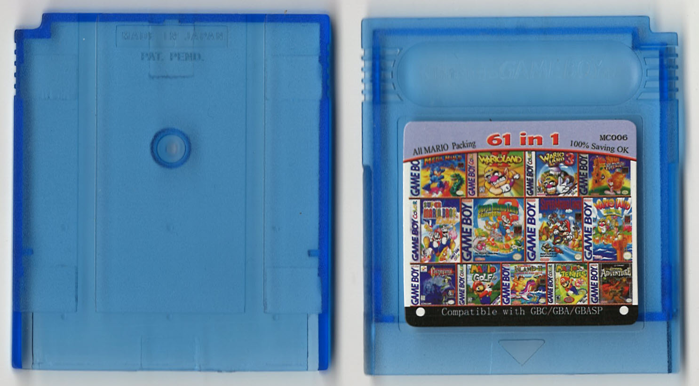
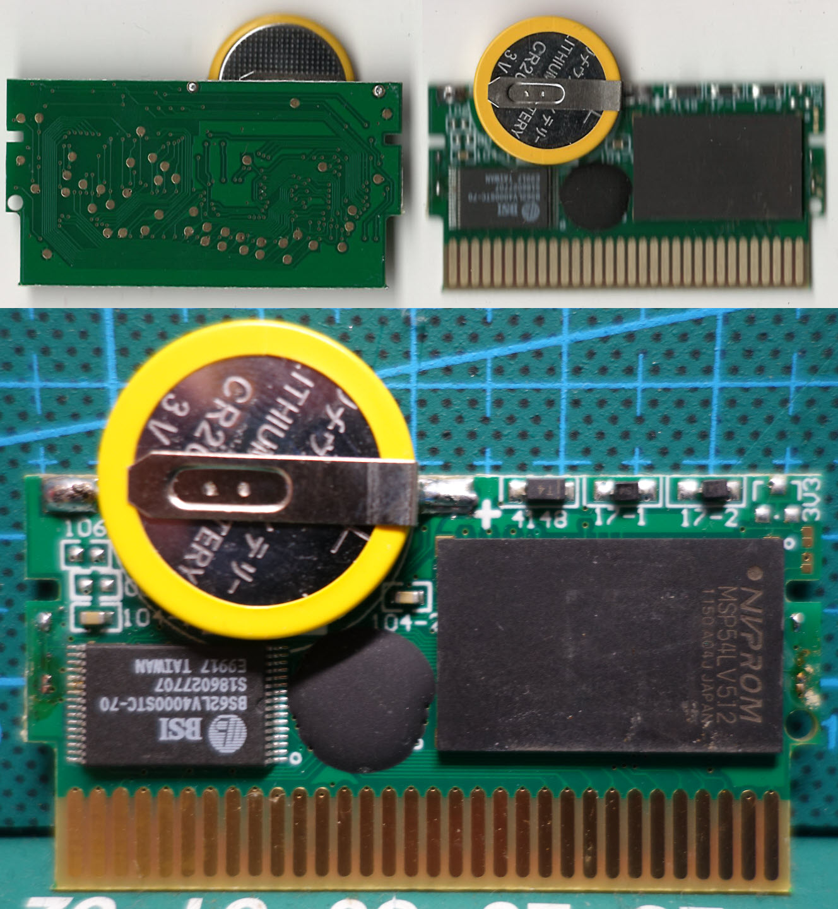
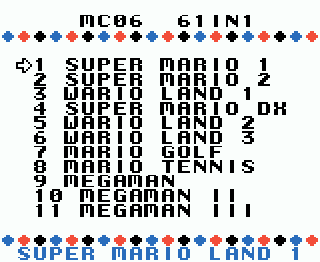

High quality PCB, support save.\
Menu is similar to the [Super 24 in 1](https://github.com/Xyl2k/Gameboy-multicarts/tree/main/108%20in%201)

Menu-dump available.

Writings on PCB:
- BSI BS62LV4000STC-70 S186027707 E9917
- NVPROM MSP54LV512 1150 A04J

