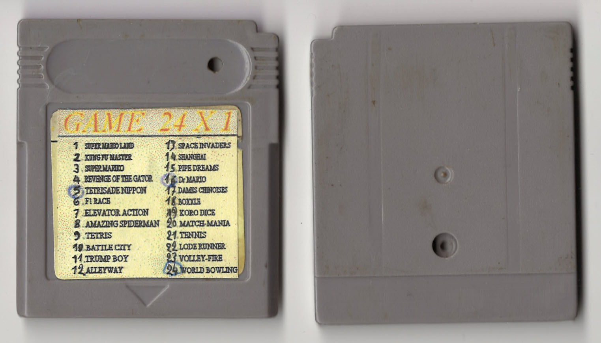
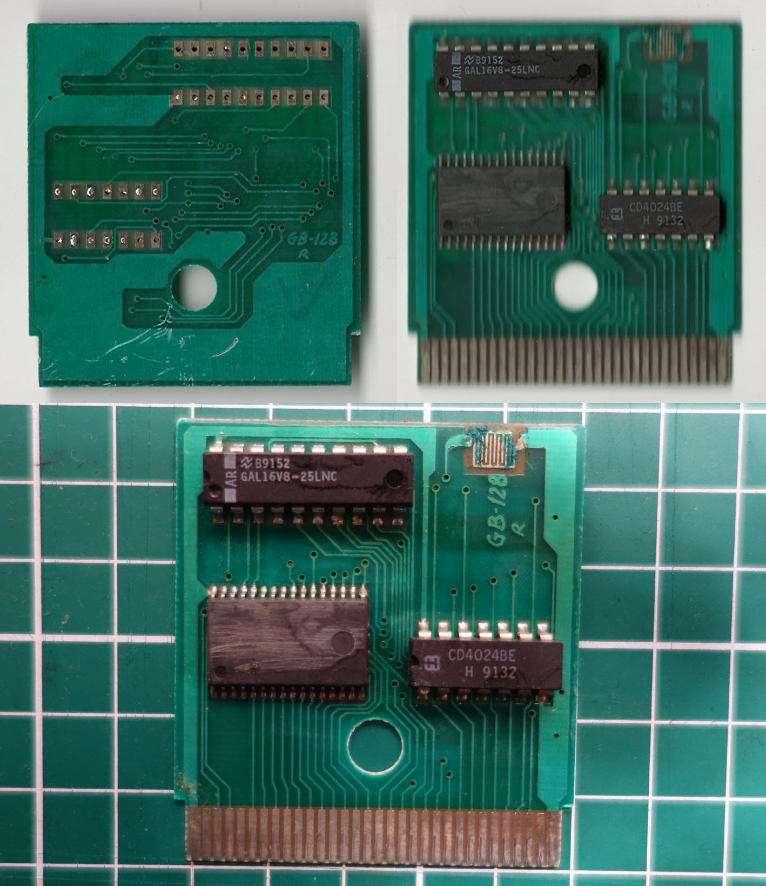
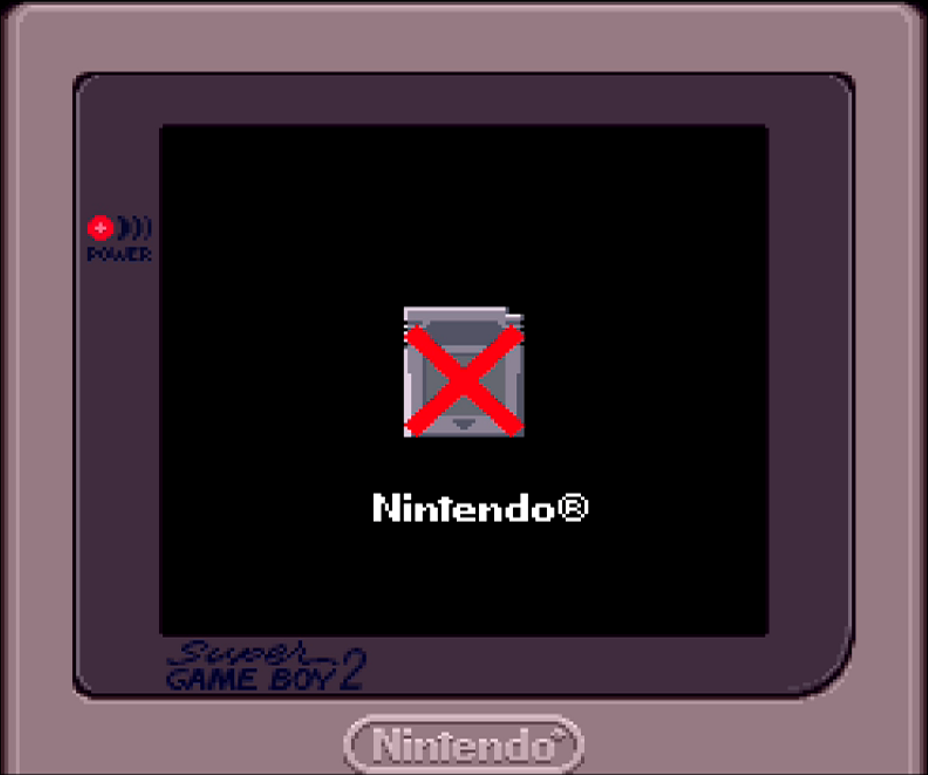

The EEPROM has been scratched, have also a reset button. On the cartridge seem the sticker was put over another sticker.

No menu-screenshot available, at start it just load a random game from the eeprom.

Writings on PCB:
- B9152 GAL16V8-25LNC
- CD4024BE H 9132
- GB-128 R

