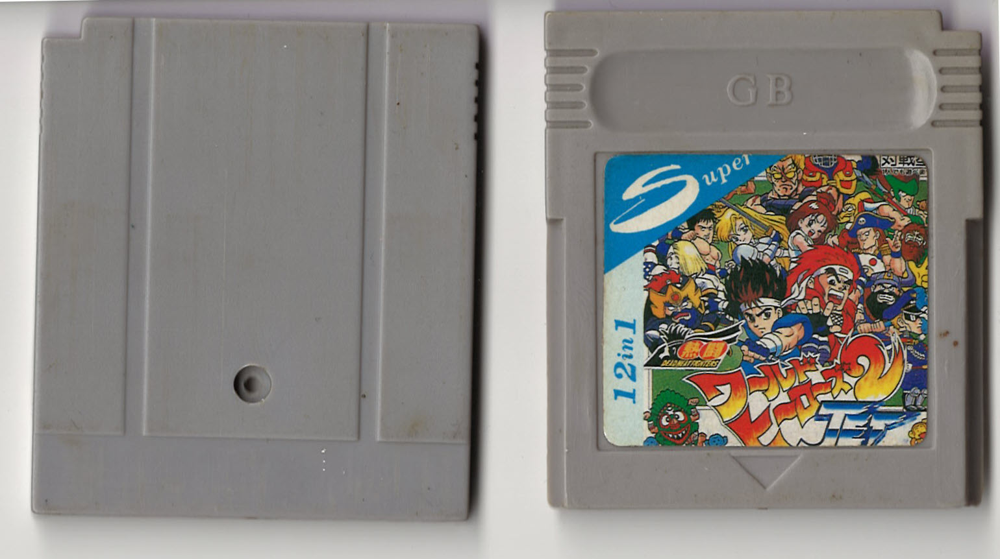
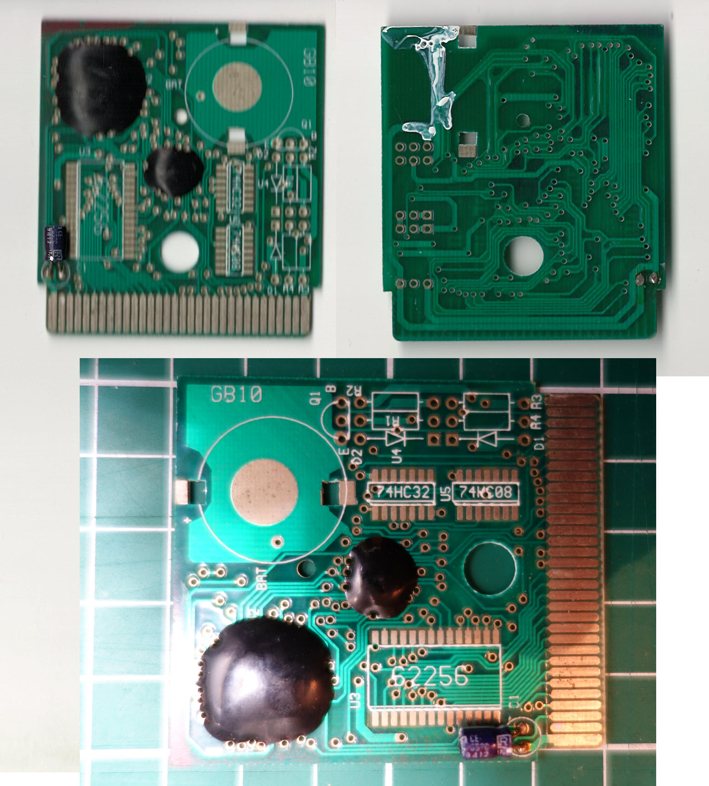

Inside the back cartridge the plastic has been dig a bit so the capacitor can fit.

Menu-dump available

Writings on PCB:
- GB10
- 74HC32 (unpopulated)
- 74HC08 (unpopulated)
- 62256 (SRAM, unpopulated)
- Battery Holder (unpopulated)
- 22µF 16V capacitor

