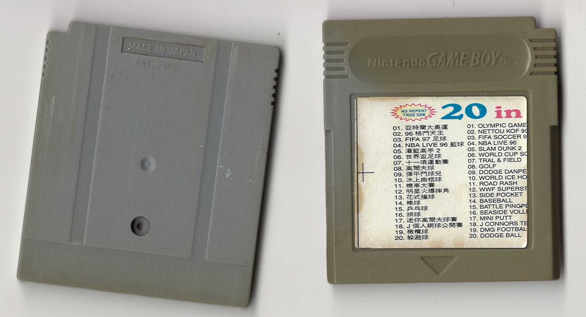
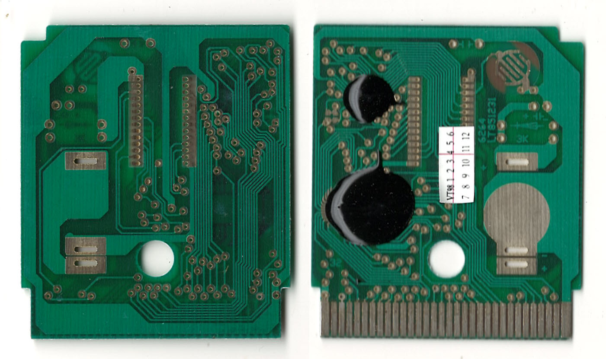
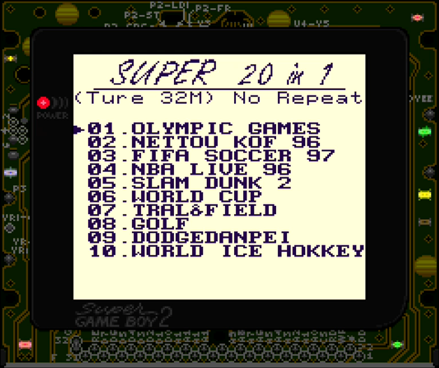

Sticker on the PCB, seem to have a reset button and a battery holder but they are unpopulated.\
Menu is similar to the [Super 24 in 1](https://github.com/Xyl2k/Gameboy-multicarts/tree/main/Super%2024%20in%201)

Writings on PCB:
- 6264 LT851231

