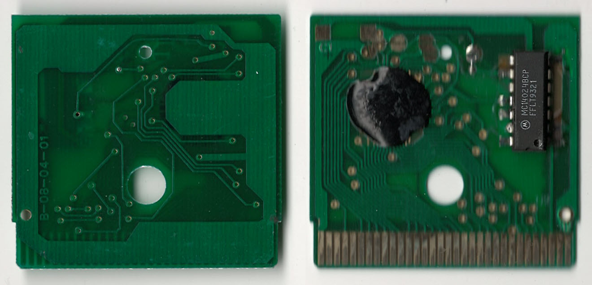
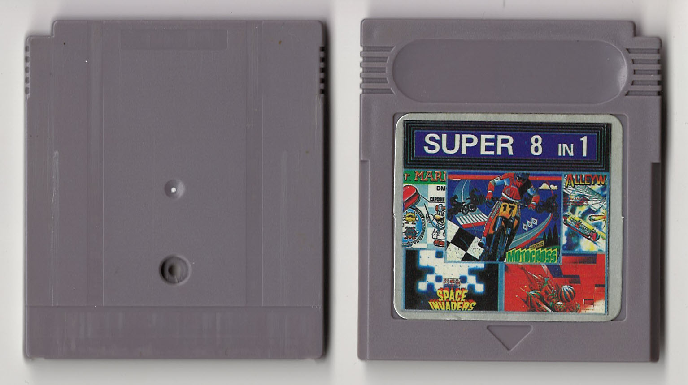
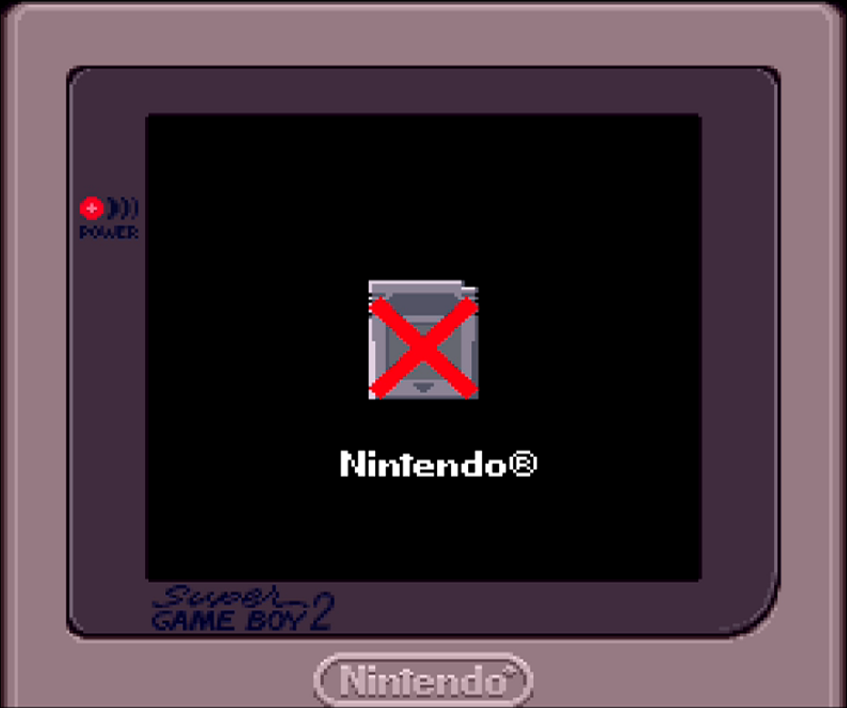

No menu, load random game on start.\
PCB similar to the [Super 4 in 1](https://github.com/Xyl2k/Gameboy-multicarts/tree/main/Super%204%20in%201)

Writings on PCB:
- B-08-04-01
- MC1024BCP FFLT9321

