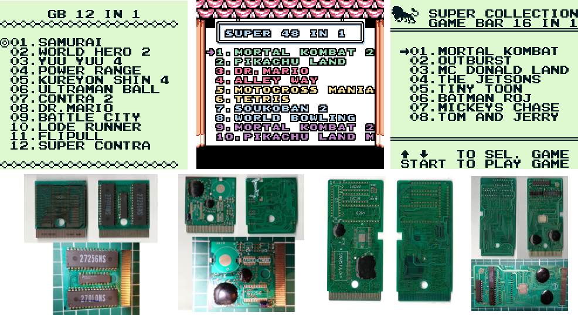

## Gameboy multicarts Collection.

Scans of gameboy pirate cartridges and PCBs.

## Contributing

Contributions to this repository are welcome, please first discuss the change/additions you wish to make via issue, email, or any other method with the owners of this repository before making any changes.\
Please use a scanner to scan the front and back of your cartridge plus the PCB, if the scan focus of the PCB isn't clear enough you can take a photo.

Dump of the menu contained in the eeprom is also welcome.\
If you can't dump the eeprom, a screenshot of the menu is recommended.

**For dumping:**\
I use an Arduino Uno with a [Gameboy Cart Shield v1.1](https://shop.insidegadgets.com/product/gameboy-cart-shield/) from InsideGadget (Discontinued, but seem they sold now [GBxCart RW](https://www.gbxcart.com/), wich looks less primitive than what i currently use)

**For screenshoting:**\
I use a [Analogue Super Nt](https://www.analogue.co/super-nt) with the [Super Gameboy 2](https://en.wikipedia.org/wiki/Super_Game_Boy#Super_Game_Boy_2) and a Elgato Game Capture HD behind the Super NT.\
That a lot of hardware just for taking a screenshot but at least there is no blur.\
When i can dump the menu, i just use the [BGB Gameboy emulator](https://bgb.bircd.org/).

